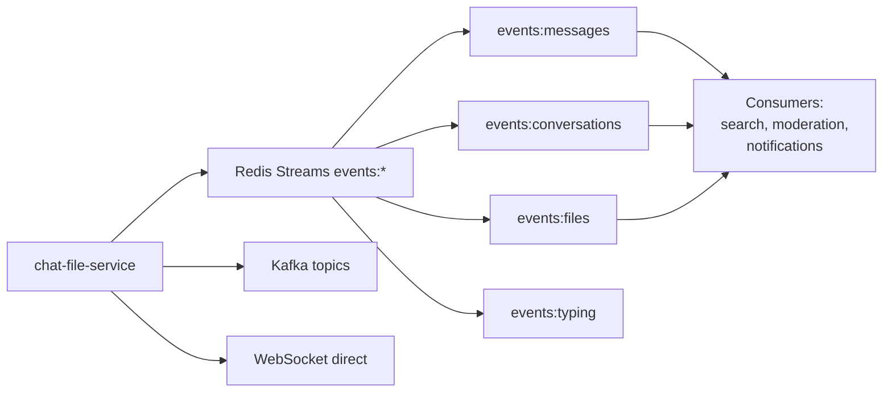

# 🔍 Audit des événements Redis Streams - chat-file-service

## 📊 État actuel des événements publiés

| #   | Stream               | Event name                       | État          | Fichier publication       | Ligne                |
| --- | -------------------- | -------------------------------- | ------------- | ------------------------- | -------------------- |
| 3   | events:messages      | message.read                     | ❌ NON PUBLIÉ | -                         | -                    |
| 4   | events:messages      | message.edited                   | ❌ NON PUBLIÉ | UpdateMessageContent.js   | Kafka seulement      |
| 5   | events:messages      | message.deleted                  | ❌ NON PUBLIÉ | -                         | -                    |
| 6   | events:conversations | conversation.created             | ❌ NON PUBLIÉ | CreateGroup.js            | Pas de stream        |
| 7   | events:conversations | conversation.participant.added   | ❌ NON PUBLIÉ | -                         | -                    |
| 8   | events:conversations | conversation.participant.removed | ❌ NON PUBLIÉ | -                         | -                    |
| 9   | events:conversations | conversation.participant.left    | ❌ NON PUBLIÉ | -                         | -                    |
| 10  | events:conversations | conversation.name.updated        | ❌ NON PUBLIÉ | -                         | -                    |
| 11  | events:conversations | conversation.avatar.updated      | ❌ NON PUBLIÉ | -                         | -                    |
| 12  | events:conversations | conversation.archived            | ❌ NON PUBLIÉ | -                         | -                    |
| 13  | events:conversations | conversation.unarchived          | ❌ NON PUBLIÉ | -                         | -                    |
| 14  | events:conversations | conversation.muted               | ❌ NON PUBLIÉ | -                         | -                    |
| 15  | events:conversations | conversation.unmuted             | ❌ NON PUBLIÉ | -                         | -                    |
| 16  | events:conversations | conversation.pinned              | ❌ NON PUBLIÉ | -                         | -                    |
| 17  | events:conversations | conversation.unpinned            | ❌ NON PUBLIÉ | -                         | -                    |
| 18  | events:files         | file.uploaded                    | ❌ NON PUBLIÉ | UploadFile.js             | Kafka seulement      |
| 19  | events:files         | file.deleted                     | ❌ NON PUBLIÉ | -                         | -                    |
| 20  | events:typing        | typing.started                   | ✅ PUBLIÉ     | MessageDeliveryService.js | stream:events:typing |
| 21  | events:typing        | typing.stopped                   | ✅ PUBLIÉ     | MessageDeliveryService.js | stream:events:typing |

---

## ✅ Ce qui EST publié actuellement

### 1. Messages (dans streams dédiés, pas events:messages)

**Stream** : `stream:messages:private`, `stream:messages:group`, `stream:messages:system`
**Fichier** : [ResilientMessageService.js](chat-file-service/src/infrastructure/services/ResilientMessageService.js#L801)
**Événement** : `NEW_MESSAGE`

```javascript
// Ligne 801-903
async publishToMessageStream(savedMessage, options = {}) {
  // Détermine automatiquement si privé ou groupe
  // Publie dans stream:messages:private OU stream:messages:group
}
```

### 2. Typing (événements de frappe)

**Stream** : `stream:events:typing`
**Fichier** : [MessageDeliveryService.js](chat-file-service/src/infrastructure/services/MessageDeliveryService.js#L25)
**Événement** : `typing.started`, `typing.stopped`

```javascript
streamKey: "stream:events:typing";
```

### 3. Read Receipts (accusés de lecture)

**Stream** : `stream:events:read`
**Fichier** : [MessageDeliveryService.js](chat-file-service/src/infrastructure/services/MessageDeliveryService.js#L53)
**Événement** : Accusés de lecture

```javascript
streamKey: "stream:events:read";
```

---

## ❌ Ce qui N'EST PAS publié dans Redis Streams

### Messages

- ❌ `message.read` - Seulement WebSocket + Redis Pub/Sub
- ❌ `message.edited` - Seulement Kafka (`MESSAGE_EDITED`)
- ❌ `message.deleted` - **Pas de publication du tout**

### Conversations

- ❌ `conversation.created` - **Pas de publication du tout**
- ❌ `conversation.participant.added` - **Pas de publication du tout**
- ❌ `conversation.participant.removed` - **Pas de publication du tout**
- ❌ `conversation.participant.left` - **Pas de publication du tout**
- ❌ `conversation.name.updated` - **Pas de publication du tout**
- ❌ `conversation.avatar.updated` - **Pas de publication du tout**
- ❌ `conversation.archived` - **Pas de publication du tout**
- ❌ `conversation.unarchived` - **Pas de publication du tout**
- ❌ `conversation.muted` - **Pas de publication du tout**
- ❌ `conversation.unmuted` - **Pas de publication du tout**
- ❌ `conversation.pinned` - **Pas de publication du tout**
- ❌ `conversation.unpinned` - **Pas de publication du tout**

### Files

- ❌ `file.uploaded` - Seulement Kafka (`FILE_UPLOADED`)
- ❌ `file.deleted` - **Pas de publication du tout**

---

## 🔄 Canaux de publication actuels

### 1. Redis Streams (limité)

```
stream:messages:private    → Messages privés (1-1)
stream:messages:group      → Messages de groupe
stream:messages:system     → Messages système
stream:events:typing       → Événements de frappe
stream:events:read         → Accusés de lecture
```

### 2. Kafka (événements métier)

```
message-service.topic → MESSAGE_EDITED, FILE_UPLOADED
```

### 3. WebSocket direct (temps réel)

```
NEW_MESSAGE           → Envoyé directement via Socket.IO
MESSAGES_READ         → Envoyé directement via Socket.IO
MESSAGES_DELIVERED    → Envoyé directement via Socket.IO
```

### 4. Redis Pub/Sub (obsolète?)

```
Certains événements utilisent encore pub/sub au lieu de streams
```

---

## 📋 Recommandations

### 🔴 HAUTE PRIORITÉ

1. **message.read** → Publier dans `events:messages`

   - Use case: [MarkMessageRead.js](chat-file-service/src/application/use-cases/MarkMessageRead.js)
   - Actuellement: WebSocket + Pub/Sub seulement

2. **conversation.created** → Publier dans `events:conversations`

   - Use case: [CreateGroup.js](chat-file-service/src/application/use-cases/CreateGroup.js)
   - Nécessaire pour synchronisation inter-services

3. **conversation.participant.added/removed** → Publier dans `events:conversations`
   - Important pour gestion des groupes

### 🟡 MOYENNE PRIORITÉ

4. **message.edited** → Ajouter Redis Streams (en plus de Kafka)

   - Use case: [UpdateMessageContent.js](chat-file-service/src/application/use-cases/UpdateMessageContent.js)
   - Actuellement: Kafka uniquement

5. **file.uploaded** → Ajouter Redis Streams (en plus de Kafka)

   - Use case: [UploadFile.js](chat-file-service/src/application/use-cases/UploadFile.js)
   - Actuellement: Kafka uniquement

6. **conversation.participant.left** → Créer use case + publier

### 🟢 BASSE PRIORITÉ

7. **message.deleted** → Créer use case + publier
8. **conversation.{name,avatar}.updated** → Créer use cases + publier
9. **conversation.{archived,muted,pinned}** → Créer use cases + publier
10. **file.deleted** → Créer use case + publier

---

## 🏗️ Architecture cible



### Stratégie recommandée

1. **Redis Streams** → Événements métier persistants (audit, sync)
2. **Kafka** → Événements complexes nécessitant traitement lourd
3. **WebSocket** → Temps réel (typing, presence)
4. **Redis Pub/Sub** → ❌ À éliminer progressivement

---

## 📝 Prochaines étapes

### Phase 1 : Messages (Haute priorité)

- [ ] Ajouter publication `message.read` dans MarkMessageRead.js
- [ ] Ajouter publication `message.edited` dans UpdateMessageContent.js
- [ ] Créer use case DeleteMessage + publication `message.deleted`

### Phase 2 : Conversations (Haute priorité)

- [ ] Ajouter publication `conversation.created` dans CreateGroup.js
- [ ] Créer use case AddParticipant + publication `conversation.participant.added`
- [ ] Créer use case RemoveParticipant + publication `conversation.participant.removed`

### Phase 3 : Files (Moyenne priorité)

- [ ] Ajouter publication `file.uploaded` dans UploadFile.js
- [ ] Créer use case DeleteFile + publication `file.deleted`

### Phase 4 : Métadonnées conversations (Basse priorité)

- [ ] Créer use cases pour name/avatar/archived/muted/pinned updates
- [ ] Publier événements correspondants

---

## 💡 Exemple d'implémentation

### Pour message.read dans MarkMessageRead.js

```javascript
// AVANT (ligne 52)
this.io.to(conversationId).emit("MESSAGES_READ", {
  conversationId,
  messageIds: readMessageIds,
  readerId: userId,
  readAt: now,
});

// APRÈS (ajouter)
// ✅ Publier dans Redis Streams
if (this.resilientMessageService?.addToStream) {
  await this.resilientMessageService.addToStream("events:messages", {
    event: "message.read",
    conversationId,
    messageIds: JSON.stringify(readMessageIds),
    readerId: userId,
    readAt: now.toISOString(),
    timestamp: Date.now().toString(),
  });
}
```

### Pour conversation.created dans CreateGroup.js

```javascript
// APRÈS ligne 120 (après sauvegarde)
// ✅ Publier dans Redis Streams
if (this.resilientMessageService?.addToStream) {
  await this.resilientMessageService.addToStream("events:conversations", {
    event: "conversation.created",
    conversationId: savedConversation._id.toString(),
    type: "GROUP",
    createdBy: adminId,
    participants: JSON.stringify(participants),
    name: name,
    timestamp: Date.now().toString(),
  });
}
```

---

## 🎯 Résumé

**Total événements demandés** : 19
**Actuellement publiés dans Redis Streams** : 2 (typing.started, typing.stopped)
**Publiés dans Kafka** : 2 (message.edited, file.uploaded)
**Non publiés du tout** : 15

**Taux de couverture Redis Streams** : 10.5% ❌

**Recommandation** : Implémenter progressivement les événements manquants en commençant par les priorités hautes (message.read, conversation.created, conversation.participant.\*).
