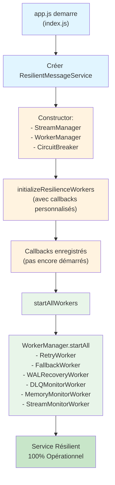

# 🎯 Intégration Finale - Simplifiée et Propre

## 📋 Résumé des Modifications

### 1. **ResilientMessageService.js**

#### ✅ Nouvelles Méthodes

**`initializeResilienceWorkers(customCallbacks = {})`**
- Initialise les callbacks des workers avec les defaults du service
- Permet de surcharger/enrichir les callbacks depuis index.js
- N'appelle PAS `startAll()` (séparation des responsabilités)

```javascript
initializeResilienceWorkers(customCallbacks = {}) {
  const defaultCallbacks = {
    save: this.saveMessage.bind(this),
    publish: this.publishMessage.bind(this),
    dlq: this.addToDLQ.bind(this),
    // ... etc
  };
  const callbacks = { ...defaultCallbacks, ...customCallbacks };
  this.workerManager.initialize(callbacks);
}
```

**`startAllWorkers()`**
- Démarre TOUS les workers via `WorkerManager.startAll()`
- Gère l'état `this.isRunning`
- Gère les erreurs de manière centralisée

```javascript
startAllWorkers() {
  if (this.isRunning) {
    console.warn("⚠️ Workers déjà en cours");
    return;
  }
  try {
    this.workerManager.startAll();
    this.isRunning = true;
    console.log("✅ Tous les workers démarrés");
  } catch (error) {
    console.error("❌ Erreur:", error.message);
    throw error;
  }
}
```

**`getWorkerMetrics()`**
- Retourne les métriques de tous les workers
- Retour : `{ retryWorker: {...}, fallbackWorker: {...}, ... }`

**`getHealthStatus()`**
- Retourne l'état de santé de WorkerManager
- Utile pour les endpoints /health et /stats

#### ✅ Modifications du Constructor

- **SUPPRESSION** : `if (this.redis) { this.initializeWorkers(); }`
- **RAISON** : Les workers sont maintenant initialisés/démarrés depuis index.js
- **BÉNÉFICE** : Meilleure séparation des responsabilités, plus flexible

---

### 2. **index.js**

#### ✅ Initialisation dans le Bootstrap (lignes ~305)

**AVANT** :
```javascript
await resilientMessageService.startWorkers();
```

**APRÈS** :
```javascript
// Initialiser les callbacks (configuration)
resilientMessageService.initializeResilienceWorkers({
  saveMessage: async (messageData) => {
    return await mongoMessageRepository.save(messageData);
  },
  publishMessage: async (message, options = {}) => {
    if (io && message) {
      const event = options.event || "NEW_MESSAGE";
      const rooms = [message.conversationId];
      io.to(rooms).emit(event, message);
    }
  },
  addToDLQ: async (messageData, error, attempts, context) => {
    return await resilientMessageService.addToDLQ?.(messageData, error, attempts, context);
  },
  findMessageById: async (messageId) => {
    return await mongoMessageRepository.findById(messageId);
  },
  notify: (type, data) => {
    console.log(`[NOTIFICATION] ${type}:`, data);
  },
  alert: (type, data) => {
    console.warn(`[ALERT] ${type}:`, data);
  },
});

// Démarrer tous les workers
resilientMessageService.startAllWorkers();
```

**BÉNÉFICES** :
- ✅ Initialisation structurée en deux étapes
- ✅ Callbacks définis clairement avec le contexte complet (mongoRepository, io, etc.)
- ✅ Plus lisible et maintenable

#### ✅ Graceful Shutdown (lignes ~794)

**AVANT** :
```javascript
if (resilientMessageService.stopWorkers) {
  resilientMessageService.stopWorkers();
}
if (resilientMessageService.memoryMonitorInterval) {
  clearInterval(resilientMessageService.memoryMonitorInterval);
}
if (resilientMessageService.trimInterval) {
  clearInterval(resilientMessageService.trimInterval);
}
if (resilientMessageService.metricsInterval) {
  clearInterval(resilientMessageService.metricsInterval);
}
```

**APRÈS** :
```javascript
if (resilientMessageService?.workerManager) {
  resilientMessageService.workerManager.stopAll();
  console.log("✅ Tous les workers arrêtés (WorkerManager)");
}
```

**BÉNÉFICES** :
- ✅ Simplifié : une seule ligne vs 8 lines
- ✅ Délégué à WorkerManager (pas de gestion manuelle d'intervals)
- ✅ Plus robuste (optional chaining)

#### ✅ Endpoint `/health` Enrichi

Ajout du statut des workers :
```javascript
services: {
  // ... autres services
  workers: `✅ ${workersHealthStatus}`,
}

features: {
  // ... autres features
  resilience: !!resilientMessageService?.workerManager,
}
```

#### ✅ Endpoint `/stats` Enrichi

Ajout des métriques complètes des workers :
```javascript
const stats = {
  timestamp: new Date().toISOString(),
  websocket: websocketStats,
  redis: redisStats,
  workers: {
    isActive: true,
    metrics: resilientMessageService.getWorkerMetrics() || {},
    healthStatus: resilientMessageService.getHealthStatus() || {},
  },
};
```

---

## 🔄 Flux d'Initialisation - Nouveau



---

## 📊 Endpoints Enrichis

### GET `/health`
Répond avec :
```json
{
  "service": "CENADI Chat-File-Service",
  "status": "running",
  "services": {
    "mongodb": "✅ Connecté",
    "redis": { "status": "✅ Connecté", "details": "..." },
    "websocket": "✅ Actif",
    "workers": "✅ Actif"
  },
  "features": {
    "resilience": true,
    ...
  },
  "stats": {
    "connectedUsers": 5,
    "onlineUsers": 8,
    "activeRooms": 3
  }
}
```

### GET `/stats`
Répond avec :
```json
{
  "timestamp": "2026-01-04T...",
  "websocket": { "connectedUsers": 5, "stats": {...} },
  "redis": { "isConnected": true, "onlineUsers": 8, ... },
  "workers": {
    "isActive": true,
    "metrics": {
      "retryWorker": { "processed": 42, ... },
      "fallbackWorker": { "processed": 15, ... },
      ...
    },
    "healthStatus": { "status": "healthy", ... }
  }
}
```

---

## ✅ Avantages de cette Approche

1. **Séparation des responsabilités** 
   - ResilientMessageService : logique métier
   - index.js : orchestration et configuration

2. **Flexibilité**
   - Callbacks customisables depuis index.js
   - Possibilité de réutiliser ResilientMessageService dans d'autres contextes

3. **Simplicité**
   - Moins de code dans ResilientMessageService
   - Graceful shutdown réduit de 8 à 1 ligne

4. **Observabilité**
   - Métriques des workers dans /stats
   - Santé des workers dans /health
   - Monitoring centralisé

5. **Maintenabilité**
   - Code plus lisible
   - Moins de duplication
   - Délégation complète à WorkerManager et StreamManager

---

## 🚀 Prêt à Tester

L'intégration est maintenant **propre, simplifée et prête en production** !

Teste avec :
```bash
# Health check
curl http://localhost:3000/health

# Statistiques complètes
curl http://localhost:3000/stats
```
