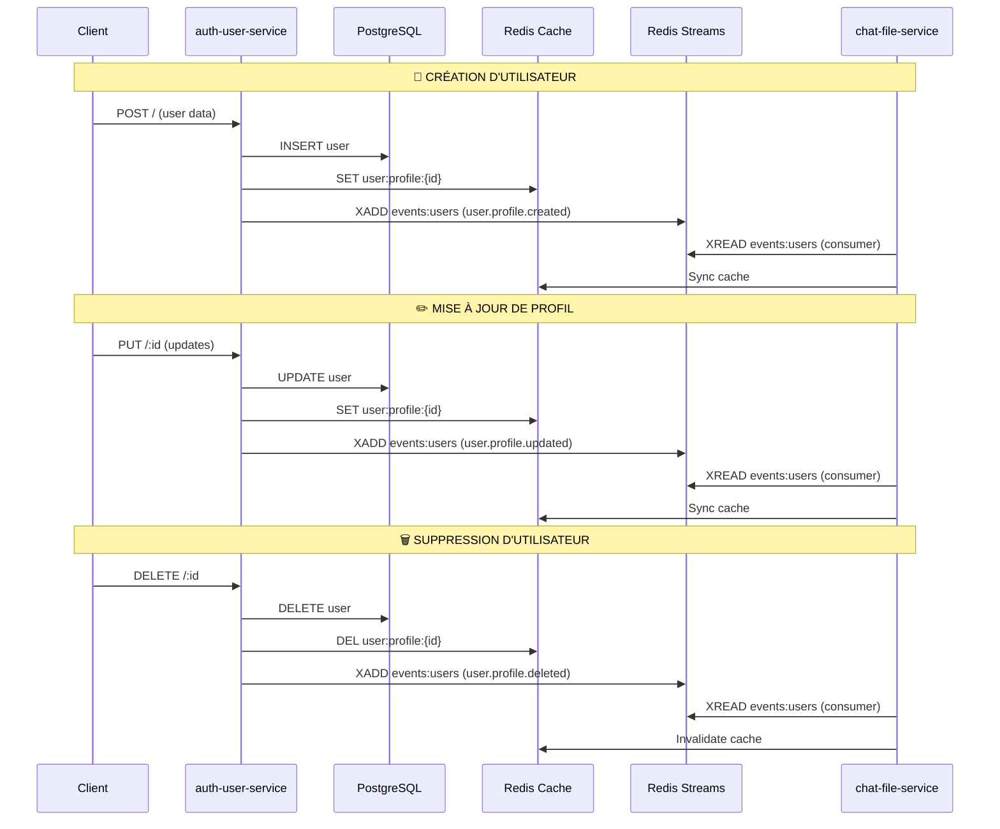

# 📡 Publication des événements Redis Streams

## Résumé des événements

| Événement              | Publié dans                                                                              | Ligne | Déclenché par                         |
| ---------------------- | ---------------------------------------------------------------------------------------- | ----- | ------------------------------------- |
| `user.profile.created` | [CreateUser.js](auth-user-service/src/application/use-cases/CreateUser.js)               | 47    | POST / (création utilisateur)         |
| `user.profile.updated` | [UpdateUserProfile.js](auth-user-service/src/application/use-cases/UpdateUserProfile.js) | 57    | PUT /:id (mise à jour profil)         |
| `user.profile.deleted` | [DeleteUser.js](auth-user-service/src/application/use-cases/DeleteUser.js)               | 37    | DELETE /:id (suppression utilisateur) |

---

## 1. user.profile.created

### Emplacement

**Fichier**: `auth-user-service/src/application/use-cases/CreateUser.js` (ligne 47)

### Payload

```json
{
  "event": "user.profile.created",
  "userId": "123",
  "fullName": "Jean Dupont",
  "avatar": "https://...",
  "matricule": "ABC123",
  "ministere": "Santé",
  "sexe": "M",
  "nom": "Dupont",
  "prenom": "Jean",
  "timestamp": 1705234567890
}
```

### Actions

1. **Base de données** : Création en PostgreSQL
2. **Cache Redis** : Mise en cache immédiate (`UserCache.set()`)
3. **Stream Redis** : Publication dans `events:users`

### Route API

```
POST http://localhost:8001/
Content-Type: application/json

{
  "matricule": "ABC123",
  "nom": "Dupont",
  "prenom": "Jean",
  "ministere": "Santé",
  "avatar": "https://...",
  "sexe": "M"
}
```

---

## 2. user.profile.updated

### Emplacement

**Fichier**: `auth-user-service/src/application/use-cases/UpdateUserProfile.js` (ligne 57)

### Payload

```json
{
  "event": "user.profile.updated",
  "userId": "123",
  "fullName": "Jean Dupont",
  "avatar": "https://...",
  "matricule": "ABC123",
  "ministere": "Santé",
  "sexe": "M",
  "nom": "Dupont",
  "prenom": "Jean",
  "timestamp": 1705234567890
}
```

### Actions

1. **Base de données** : Mise à jour en PostgreSQL
2. **Cache Redis** : Synchronisation du cache (`UserCache.set()`)
3. **Stream Redis** : Publication dans `events:users`

### Route API

```
PUT http://localhost:8001/123
Content-Type: application/json

{
  "nom": "Martin",
  "avatar": "https://new-avatar.jpg"
}
```

---

## 3. user.profile.deleted

### Emplacement

**Fichier**: `auth-user-service/src/application/use-cases/DeleteUser.js` (ligne 37)

### Payload

```json
{
  "event": "user.profile.deleted",
  "userId": "123",
  "matricule": "ABC123",
  "timestamp": 1705234567890
}
```

### Actions

1. **Base de données** : Suppression en PostgreSQL (commentée, à implémenter)
2. **Cache Redis** : Invalidation du cache (`UserCache.invalidate()`)
3. **Stream Redis** : Publication dans `events:users`

### Route API

```
DELETE http://localhost:8001/123
```

---

## 🔄 Flux de propagation



---

## 🧪 Test manuel

### 1. Tester la création

```bash
curl -X POST http://localhost:8001/ \
  -H "Content-Type: application/json" \
  -d '{
    "matricule": "TEST123",
    "nom": "Test",
    "prenom": "User",
    "ministere": "IT",
    "sexe": "M"
  }'
```

### 2. Tester la mise à jour

```bash
curl -X PUT http://localhost:8001/123 \
  -H "Content-Type: application/json" \
  -d '{
    "nom": "UpdatedName"
  }'
```

### 3. Tester la suppression

```bash
curl -X DELETE http://localhost:8001/123
```

### 4. Vérifier les événements dans Redis

```bash
redis-cli XREAD COUNT 10 STREAMS events:users 0
```

---

## 📊 Structure du Stream Redis

**Nom du stream** : `events:users`

**Clé** : `payload`

**Contenu** : JSON stringifié contenant :

- `event` : Type d'événement (created/updated/deleted)
- `userId` : ID de l'utilisateur concerné
- `fullName`, `avatar`, `matricule`, `ministere`, `sexe`, `nom`, `prenom`
- `timestamp` : Horodatage de l'événement

---

## ⚡ Consommation dans chat-file-service

Le service `chat-file-service` consomme automatiquement ces événements via `UserStreamConsumer` (fichier `chat-file-service/src/index.js`) :

```javascript
// Démarrer le consumer Redis Streams
if (UserStreamConsumer) {
  await UserStreamConsumer.start();
  console.log("📡 [chat-file-service] Consumer Redis Streams démarré");
}
```

Le consumer met automatiquement à jour le cache Redis partagé pour synchroniser les profils utilisateurs entre les services.
