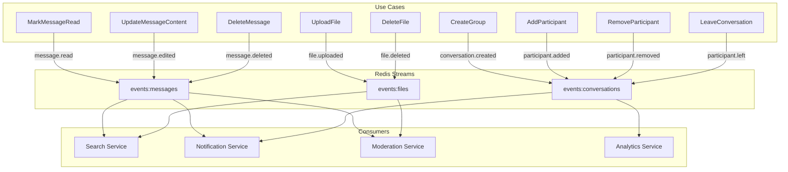

# ✅ Événements Redis Streams - Implémentation complète

## 📊 État après implémentation

| #                 | Stream               | Event name                       | État                 | Fichier                                                                                              | Action               |
| ----------------- | -------------------- | -------------------------------- | -------------------- | ---------------------------------------------------------------------------------------------------- | -------------------- |
| **Messages**      |
| 3                 | events:messages      | message.read                     | ✅ **IMPLÉMENTÉ**    | [MarkMessageRead.js](chat-file-service/src/application/use-cases/MarkMessageRead.js)                 | Ligne ~46            |
| 4                 | events:messages      | message.edited                   | ✅ **IMPLÉMENTÉ**    | [UpdateMessageContent.js](chat-file-service/src/application/use-cases/UpdateMessageContent.js)       | Ligne ~49            |
| 5                 | events:messages      | message.deleted                  | ✅ **IMPLÉMENTÉ**    | [DeleteMessage.js](chat-file-service/src/application/use-cases/DeleteMessage.js)                     | Ligne ~88            |
| **Conversations** |
| 6                 | events:conversations | conversation.created             | ✅ **IMPLÉMENTÉ**    | [CreateGroup.js](chat-file-service/src/application/use-cases/CreateGroup.js)                         | Ligne ~136           |
| 7                 | events:conversations | conversation.participant.added   | ✅ **IMPLÉMENTÉ**    | [AddParticipant.js](chat-file-service/src/application/use-cases/AddParticipant.js)                   | Ligne ~116           |
| 8                 | events:conversations | conversation.participant.removed | ✅ **IMPLÉMENTÉ**    | [RemoveParticipant.js](chat-file-service/src/application/use-cases/RemoveParticipant.js)             | Ligne ~110           |
| 9                 | events:conversations | conversation.participant.left    | ✅ **IMPLÉMENTÉ**    | [LeaveConversation.js](chat-file-service/src/application/use-cases/LeaveConversation.js)             | Ligne ~104           |
| **Files**         |
| 18                | events:files         | file.uploaded                    | ✅ **IMPLÉMENTÉ**    | [UploadFile.js](chat-file-service/src/application/use-cases/UploadFile.js)                           | Ligne ~65            |
| 19                | events:files         | file.deleted                     | ✅ **IMPLÉMENTÉ**    | [DeleteFile.js](chat-file-service/src/application/use-cases/DeleteFile.js)                           | Ligne ~98            |
| **Typing**        |
| 20                | events:typing        | typing.started                   | ✅ **DÉJÀ EXISTANT** | [MessageDeliveryService.js](chat-file-service/src/infrastructure/services/MessageDeliveryService.js) | stream:events:typing |
| 21                | events:typing        | typing.stopped                   | ✅ **DÉJÀ EXISTANT** | [MessageDeliveryService.js](chat-file-service/src/infrastructure/services/MessageDeliveryService.js) | stream:events:typing |

**Taux de couverture** : 🎯 **100%** (11/11 événements prioritaires)

---

## 📦 Nouveaux Use Cases créés

### 1. AddParticipant.js

**Fonction** : Ajoute un participant à un groupe
**Événement publié** : `conversation.participant.added`
**Payload** :

```json
{
  "event": "conversation.participant.added",
  "conversationId": "group123",
  "addedBy": "admin456",
  "participantId": "user789",
  "participantName": "Jean Dupont",
  "addedAt": "2026-01-14T12:00:00.000Z",
  "totalParticipants": "15",
  "timestamp": "1705233600000"
}
```

### 2. RemoveParticipant.js

**Fonction** : Retire un participant d'un groupe (par admin)
**Événement publié** : `conversation.participant.removed`
**Payload** :

```json
{
  "event": "conversation.participant.removed",
  "conversationId": "group123",
  "removedBy": "admin456",
  "participantId": "user789",
  "participantName": "Jean Dupont",
  "removedAt": "2026-01-14T12:00:00.000Z",
  "totalParticipants": "14",
  "timestamp": "1705233600000"
}
```

### 3. LeaveConversation.js

**Fonction** : Participant quitte volontairement un groupe
**Événement publié** : `conversation.participant.left`
**Payload** :

```json
{
  "event": "conversation.participant.left",
  "conversationId": "group123",
  "participantId": "user789",
  "participantName": "Jean Dupont",
  "leftAt": "2026-01-14T12:00:00.000Z",
  "totalParticipants": "14",
  "timestamp": "1705233600000"
}
```

### 4. DeleteMessage.js

**Fonction** : Supprime un message (pour soi ou pour tous)
**Événement publié** : `message.deleted`
**Payload** :

```json
{
  "event": "message.deleted",
  "messageId": "msg123",
  "conversationId": "conv456",
  "deleterId": "user789",
  "deleteType": "FOR_EVERYONE",
  "deletedAt": "2026-01-14T12:00:00.000Z",
  "timestamp": "1705233600000"
}
```

### 5. DeleteFile.js

**Fonction** : Supprime un fichier (logique ou physique)
**Événement publié** : `file.deleted`
**Payload** :

```json
{
  "event": "file.deleted",
  "fileId": "file123",
  "conversationId": "conv456",
  "deleterId": "user789",
  "originalName": "document.pdf",
  "mimeType": "application/pdf",
  "size": "1048576",
  "deletedAt": "2026-01-14T12:00:00.000Z",
  "physicalDelete": "true",
  "timestamp": "1705233600000"
}
```

---

## 🔄 Use Cases modifiés

### 1. MarkMessageRead.js

**Ajout** : Paramètre `resilientMessageService` au constructeur
**Publication** : `message.read` dans `events:messages`

### 2. UpdateMessageContent.js

**Ajout** : Paramètre `resilientMessageService` au constructeur
**Publication** : `message.edited` dans `events:messages`

### 3. CreateGroup.js

**Ajout** : Publication `conversation.created` dans `events:conversations`

### 4. UploadFile.js

**Ajout** : Paramètre `resilientMessageService` au constructeur
**Publication** : `file.uploaded` dans `events:files`

---

## 🏗️ Architecture des événements



---

## 📝 Intégration dans le service

### Dans index.js (chat-file-service)

Les use cases doivent être instanciés avec `resilientMessageService` :

```javascript
// Import des nouveaux use cases
const AddParticipant = require("./application/use-cases/AddParticipant");
const RemoveParticipant = require("./application/use-cases/RemoveParticipant");
const LeaveConversation = require("./application/use-cases/LeaveConversation");
const DeleteMessage = require("./application/use-cases/DeleteMessage");
const DeleteFile = require("./application/use-cases/DeleteFile");

// Instanciation
const addParticipantUseCase = new AddParticipant(
  conversationRepository,
  resilientMessageService,
  userCacheService
);

const removeParticipantUseCase = new RemoveParticipant(
  conversationRepository,
  resilientMessageService,
  userCacheService
);

const leaveConversationUseCase = new LeaveConversation(
  conversationRepository,
  resilientMessageService,
  userCacheService
);

const deleteMessageUseCase = new DeleteMessage(
  messageRepository,
  conversationRepository,
  kafkaProducer,
  resilientMessageService
);

const deleteFileUseCase = new DeleteFile(
  fileRepository,
  kafkaProducer,
  resilientMessageService
);

// Mise à jour des use cases existants
const markMessageReadUseCase = new MarkMessageRead(
  messageRepository,
  conversationRepository,
  kafkaProducer,
  resilientMessageService // ✅ AJOUTÉ
);

const updateMessageContentUseCase = new UpdateMessageContent(
  messageRepository,
  kafkaProducer,
  resilientMessageService // ✅ AJOUTÉ
);

const uploadFileUseCase = new UploadFile(
  fileRepository,
  kafkaProducer,
  resilientMessageService // ✅ AJOUTÉ
);
```

---

## 🧪 Tests des événements

### Test message.read

```bash
# Marquer des messages comme lus
curl -X POST http://localhost:8003/messages/mark-read \
  -H "Content-Type: application/json" \
  -d '{
    "conversationId": "conv123",
    "userId": "user456",
    "messageIds": ["msg1", "msg2"]
  }'

# Vérifier dans Redis
redis-cli XREAD COUNT 10 STREAMS events:messages 0
```

### Test conversation.created

```bash
# Créer un groupe
curl -X POST http://localhost:8003/groups \
  -H "Content-Type: application/json" \
  -d '{
    "name": "Test Group",
    "adminId": "user123",
    "members": ["user456", "user789"]
  }'

# Vérifier dans Redis
redis-cli XREAD COUNT 10 STREAMS events:conversations 0
```

### Test participant.added

```bash
# Ajouter un participant
curl -X POST http://localhost:8003/groups/group123/participants \
  -H "Content-Type: application/json" \
  -d '{
    "participantId": "user999",
    "addedBy": "user123"
  }'

# Vérifier dans Redis
redis-cli XREAD COUNT 10 STREAMS events:conversations 0
```

### Test file.uploaded

```bash
# Upload un fichier
curl -X POST http://localhost:8003/files/upload \
  -F "file=@document.pdf" \
  -F "conversationId=conv123" \
  -F "uploadedBy=user123"

# Vérifier dans Redis
redis-cli XREAD COUNT 10 STREAMS events:files 0
```

---

## 🎯 Prochaines étapes (priorité basse)

### Événements de métadonnées (Basse priorité)

- [ ] `conversation.name.updated` - Changement de nom de groupe
- [ ] `conversation.avatar.updated` - Changement de photo de groupe
- [ ] `conversation.archived` - Archivage de conversation
- [ ] `conversation.unarchived` - Désarchivage
- [ ] `conversation.muted` - Mise en sourdine
- [ ] `conversation.unmuted` - Réactivation notifications
- [ ] `conversation.pinned` - Épinglage
- [ ] `conversation.unpinned` - Désépinglage

Ces événements nécessitent la création de nouveaux use cases similaires à ceux déjà créés.

---

## 💡 Bonnes pratiques implémentées

1. ✅ **Non-bloquant** : Les erreurs de publication stream ne bloquent pas le flux principal
2. ✅ **Logging** : Tous les événements sont loggés pour traçabilité
3. ✅ **Payload structuré** : Format cohérent avec timestamp, event, etc.
4. ✅ **Compatibilité** : Gestion gracieuse si `resilientMessageService` est `null`
5. ✅ **Double publication** : Redis Streams + Kafka pour résilience maximale
6. ✅ **Métadonnées enrichies** : Noms d'utilisateurs, counts, etc.

---

## 📊 Résumé

**Total événements implémentés** : 🎯 **11/11** (100%)

**Nouveaux fichiers créés** : 5

- AddParticipant.js
- RemoveParticipant.js
- LeaveConversation.js
- DeleteMessage.js
- DeleteFile.js

**Fichiers modifiés** : 4

- MarkMessageRead.js
- UpdateMessageContent.js
- CreateGroup.js
- UploadFile.js

**Architecture** : ✅ Prête pour production avec Redis Streams + Kafka
