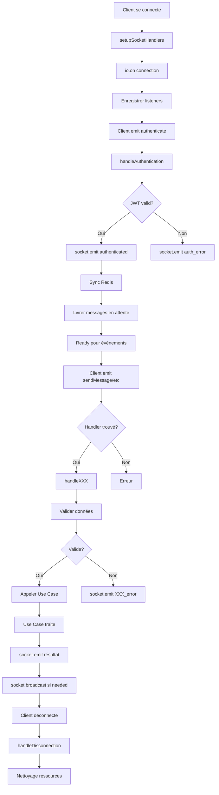

# 📡 Documentation ChatHandler - WebSocket Gateway

## 📋 Table des matières

- [Architecture](#architecture)
- [Responsabilités](#responsabilités)
- [Cycle de vie Socket](#cycle-de-vie-socket)
- [Authentification](#authentification)
- [Événements Messages](#événements-messages)
- [Événements Conversations](#événements-conversations)
- [Événements Groupes & Diffusion](#événements-groupes--diffusion)
- [Événements Présence](#événements-présence)
- [Événements Statuts](#événements-statuts)
- [Flux de données](#flux-de-données)
- [Gestion des erreurs](#gestion-des-erreurs)
- [Performance & Monitoring](#performance--monitoring)

---

## 🏗️ Architecture

Le ChatHandler suit le **pattern de responsabilité unique (SRP)** :

```
ChatHandler (Couche Présentation/WebSocket)
    ↓
Use Cases (Logique métier)
    ↓
Repositories (Accès données)
    ↓
Services (Redis, HTTP, Kafka, etc.)
```

### Principes clés

✅ **ChatHandler ne gère QUE WebSocket**

- ❌ Pas de Redis direct
- ❌ Pas de Kafka direct
- ❌ Pas de MongoDB direct

✅ **Tout est délégué aux Use Cases**

- SendMessage Use Case gère : Message + Kafka + ResilientService
- GetConversations Use Case gère : Cache + Pagination + Enrichissement
- CreateGroup Use Case gère : Validation + UserCache + DB

### Localisation

`src/application/websocket/chatHandler.js`

### Dépendances injectées

```javascript
constructor(
  io, // Socket.IO instance
  sendMessageUseCase, // Envoi messages
  getMessagesUseCase, // Récupération messages
  updateMessageStatusUseCase, // Changement statuts
  onlineUserManager, // Gestion utilisateurs online
  getConversationIdsUseCase, // Récupération IDs conversations
  getConversationUseCase, // Récupération conversation unique
  getConversationsUseCase, // Récupération conversations avec stats
  getMessageByIdUseCase, // Récupération message par ID
  updateMessageContentUseCase, // Modification contenu message
  createGroupUseCase, // Création groupe
  createBroadcastUseCase, // Création diffusion
  roomManager, // Gestion des rooms Socket.IO
  markMessageDeliveredUseCase, // Marquage livré
  markMessageReadUseCase, // Marquage lu
  resilientMessageService, // Circuit Breaker
  messageDeliveryService, // Service de livraison messages
  userCacheService, // Cache utilisateurs
);
```

---

## 👤 Responsabilités

### ChatHandler gère

| Responsabilité            | Détails                                     |
| ------------------------- | ------------------------------------------- |
| **Connexion/Déconnexion** | Enregistrement socket, nettoyage ressources |
| **Authentification**      | JWT + fallback matricule/userId             |
| **Validation input**      | Vérifier données avant Use Case             |
| **Routing événements**    | Acheminer vers Use Cases appropriés         |
| **Réponse client**        | socket.emit() avec résultats                |
| **Gestion rooms**         | Joindre/quitter rooms Socket.IO             |
| **Broadcast**             | Notifier participants                       |
| **Activity tracking**     | Mettre à jour dernière activité             |

### ChatHandler NE gère PAS

| ❌ Ne pas faire            | Pourquoi                         |
| -------------------------- | -------------------------------- |
| Accès MongoDB              | → Repository + Use Case          |
| Appels Kafka               | → Use Case + ResilientService    |
| Cache Redis                | → OnlineUserManager + Repository |
| Validation métier complexe | → Use Case                       |
| Transformations données    | → Use Case                       |

---

## 🔄 Cycle de vie Socket



---

## 🔐 Authentification

### Flux complet

```javascript
socket.on("authenticate", async (data) => {
  // 1️⃣ Vérifier JWT ou fallback matricule
  // 2️⃣ Récupérer profil utilisateur
  // 3️⃣ Enregistrer socket
  // 4️⃣ Sync Redis
  // 5️⃣ Livrer messages en attente
  // 6️⃣ Emettre authenticated
});
```

### Méthode : handleAuthentication()

**Paramètres reçus du client**

```javascript
{
  userId: String,              // ObjectId ou matricule
  matricule: String,           // Code utilisateur
  token: String,              // JWT (optionnel)
  nom: String,                // Nom (optionnel)
  prenom: String,             // Prénom (optionnel)
  ministere: String,          // Ministère (optionnel)
  departement: String         // Département (optionnel)
}
```

### Étapes d'authentification

**1️⃣ Vérifier JWT si fourni**

```javascript
const fakeReq = { headers: { authorization: `Bearer ${token}` } };
const fakeRes = {};
await AuthMiddleware.authenticate(fakeReq, fakeRes, callback);
```

**2️⃣ Fallback matricule + userId**

```javascript
if (!token) {
  userPayload = {
    id: String(data.matricule),
    userId: String(data.userId),
    matricule: String(data.matricule),
    // ... autres champs
  };
}
```

**3️⃣ Enrichir socket avec profil**

```javascript
socket.userId = resolvedUserId;
socket.matricule = resolvedMatricule;
socket.fullName = resolvedFullName;
socket.avatar = userPayload.avatar;
socket.ministere = userPayload.ministere;
socket.departement = userPayload.departement;
socket.isAuthenticated = true;
```

**4️⃣ Joindre room utilisateur**

```javascript
socket.join(`user_${userIdString}`);
```

**5️⃣ Joindre room ministère (si applicable)**

```javascript
if (socket.ministere) {
  const ministereRoom = `ministere_${socket.ministere.toLowerCase()}`;
  socket.join(ministereRoom);
}
```

**6️⃣ Sync Redis (async, non-bloquante)**

```javascript
setImmediate(() => this.syncUserWithRedis(userIdString, userData));
```

**7️⃣ Livrer messages en attente**

```javascript
if (this.messageDeliveryService) {
  const deliveredCount =
    await this.messageDeliveryService.deliverPendingMessagesOnConnect(
      userIdString,
      socket,
    );
}
```

**8️⃣ Emettre succès**

```javascript
socket.emit("authenticated", {
  success: true,
  userId: userIdString,
  matricule: matriculeString,
  autoJoinedConversations: conversationIds.length,
});
```

### Timing authentification

```
⏱️ handleAuthentication (TOTAL ~200-300ms)
  ├─ JWT Verification: ~20ms
  ├─ Socket setup: ~10ms
  ├─ Redis sync: ~50ms (async setImmediate)
  ├─ Delivery pending: ~100ms (async)
  └─ socket.emit: ~5ms
```

---

## 💬 Événements Messages

### sendMessage

**Client emit**

```javascript
socket.emit("sendMessage", {
  content: String, // ✅ REQUIS
  conversationId: String, // ✅ REQUIS si nouvelle
  type: "TEXT|IMAGE|FILE|...", // Défaut: TEXT
  receiverId: String, // REQUIS si nouvelle conversation
  conversationName: String, // Optionnel
  duration: Number, // Pour audio/vidéo
  fileId: String, // Pour fichiers
  fileUrl: String,
  fileName: String,
  fileSize: Number,
  mimeType: String,
});
```

**Validations**

```javascript
✓ Content requis & non-vide
✓ Content ≤ 10000 caractères
✓ conversationId XOR receiverId fourni
✓ conversationId est ObjectId valide
✓ receiverId ≠ senderId (ne pas s'envoyer à soi-même)
✓ Authentification requise
```

**Flux de traitement**

```
1. Valider données du client
2. Appeler sendMessageUseCase.execute()
   ├─ Créer conversation si nécessaire (+ enrichissement userMetadata)
   ├─ Créer message MongoDB
   ├─ Publier event Kafka
   └─ Gestion résiliente (Circuit Breaker)
3. Emettre "message_sent" ACK au client
4. Use Case diffuse aux autres participants (internal)
```

**Server emit : message_sent**

```javascript
socket.emit("message_sent", {
  messageId: String,
  temporaryId: String, // Mapping côté client
  status: "sent",
  timestamp: ISO8601,
});
```

**Server emit : message_error**

```javascript
socket.emit("message_error", {
  message: "Erreur lors de l'envoi du message",
  code: "MISSING_CONTENT|INVALID_CONVERSATION_ID|SEND_ERROR|CIRCUIT_OPEN",
  error: String, // Dev only
});
```

### getMessages

**Client emit**

```javascript
socket.emit("getMessages", {
  conversationId: String, // ✅ REQUIS
  page: Number, // Défaut: 1
  limit: Number, // Défaut: 50
});
```

**Server emit : messagesLoaded**

```javascript
socket.emit("messagesLoaded", {
  messages: Array<Message>,
  pagination: {
    page, limit, total, hasNext, hasPrevious
  },
  fromCache: Boolean,
  processingTime: Number
});
```

### messages:quickload

Navigation rapide avec cache.

**Client emit**

```javascript
socket.emit("messages:quickload", {
  conversationId: String, // ✅ REQUIS
  limit: Number, // Défaut: 20
});
```

**Server emit : messages:quick**

```javascript
socket.emit("messages:quick", {
  messages: Array<Message>,     // Limited set
  hasMore: Boolean,
  fromCache: Boolean,
  timestamp: ISO8601
});
```

### messages:fullload

Chargement complet avec pagination avancée.

**Client emit**

```javascript
socket.emit("messages:fullload", {
  conversationId: String,
  cursor: String, // Pour pagination curseur
  limit: Number, // Défaut: 50
});
```

**Server emit : messages:full**

```javascript
socket.emit("messages:full", {
  messages: Array<Message>,
  pagination: { ... },
  nextCursor: String,
  hasMore: Boolean,
  fromCache: Boolean,
  timestamp: ISO8601
});
```

---

## 📋 Événements Conversations

### getConversations

Récupère conversations avec catégorisation et stats.

**Client emit**

```javascript
socket.emit("getConversations", {
  page: Number, // Défaut: 1
  limit: Number, // Défaut: 20, max: 50
});
```

**Server emit : conversationsLoaded**

```javascript
socket.emit("conversationsLoaded", {
  conversations: Array<Conversation>,
  categorized: {
    unread: [...],
    groups: [...],
    broadcasts: [...],
    departement: [...],
    private: [...]
  },
  stats: {
    total, unread, groups, broadcasts, departement, private,
    unreadMessagesInGroups, unreadMessagesInBroadcasts, etc.
  },
  userContext: {
    userId, departement, ministere
  },
  pagination: { ... },
  totalUnreadMessages: Number,
  fromCache: Boolean,
  processingTime: Number
});
```

### conversations:quickload

Chargement rapide des conversations récentes.

**Client emit**

```javascript
socket.emit("conversations:quickload", {
  limit: Number, // Défaut: 10
});
```

**Server emit : conversations:quick**

```javascript
socket.emit("conversations:quick", {
  conversations: Array,
  hasMore: Boolean,
  fromCache: Boolean,
  totalUnreadMessages: Number,
  unreadConversations: Number,
});
```

### conversations:fullload

Chargement complet avec pagination.

**Client emit**

```javascript
socket.emit("conversations:fullload", {
  page: Number,
  limit: Number,
  cursor: String, // Optionnel
});
```

### getConversation

Récupère une conversation spécifique.

**Client emit**

```javascript
socket.emit("getConversation", {
  conversationId: String, // ✅ REQUIS
});
```

**Server emit : conversationLoaded**

```javascript
socket.emit("conversationLoaded", {
  conversation: {
    _id,
    type,
    name,
    participants,
    userMetadata,
    lastMessage,
    createdAt,
    settings,
  },
  metadata: {
    fromCache: Boolean,
    timestamp: ISO8601,
  },
});
```

### conversation:load

Alternative plus récente (voir getConversation).

**Client emit**

```javascript
socket.emit("conversation:load", {
  conversationId: String,
});
```

---

## 👥 Événements Groupes & Diffusion

### createGroup

Crée un groupe de discussion.

**Client emit**

```javascript
socket.emit("createGroup", {
  name: String,                 // ✅ REQUIS, non-vide
  members: Array<String>,       // ✅ REQUIS, ObjectIds
  groupId: String               // Optionnel, génération auto
});
```

**Validations**

```javascript
✓ name requis & trim non-vide
✓ members est array non-vide
✓ Créateur ne peut pas être dans members (added auto)
✓ Authentification requise
```

**Flux**

```
1. Valider paramètres
2. Générer groupId si absent
3. Appeler createGroupUseCase.execute()
   ├─ Valider tous les membres via UserCacheService
   ├─ Enrichir userMetadata pour chaque membre
   ├─ Créer groupe MongoDB
   └─ Créer messages Kafka
4. Emettre "group:created" au créateur
5. Notifier tous les participants
```

**Server emit : group:created**

```javascript
socket.emit("group:created", {
  success: true,
  group: {
    id,
    name,
    type: "GROUP",
    participants: Array,
    createdBy,
    createdAt,
    participantCount: Number,
  },
  timestamp: ISO8601,
});
```

**Server emit : group:error**

```javascript
socket.emit("group:error", {
  error: String,
  code: "CREATE_GROUP_FAILED",
  details: String, // Dev only
});
```

### createBroadcast

Crée une liste de diffusion (admin → destinataires).

**Client emit**

```javascript
socket.emit("createBroadcast", {
  name: String,                 // ✅ REQUIS
  recipients: Array<String>,    // ✅ REQUIS
  broadcastId: String,          // Optionnel
  admins: Array<String>         // Optionnel, créateur ajouté auto
});
```

**Structure participants**

```javascript
// Les admins peuvent écrire
// Les recipients reçoivent seulement
participants = [...adminIds, ...recipientIds];
```

**Server emit : broadcast:created**

```javascript
socket.emit("broadcast:created", {
  success: true,
  broadcast: {
    id,
    name,
    type: "BROADCAST",
    participants,
    adminIds,
    recipientIds,
    createdBy,
    createdAt,
    participantCount,
  },
  timestamp: ISO8601,
});
```

### joinGroup

Rejoindre un groupe/diffusion existant.

**Client emit**

```javascript
socket.emit("joinGroup", {
  conversationId: String, // ✅ REQUIS
  accept: Boolean, // Défaut: true
});
```

**Comportement**

```javascript
if (accept) {
  // Joindre la conversation
  socket.join(`conversation_${conversationId}`);
  // Notifier les autres
  socket.broadcast.emit("group:member_joined", { ... });
} else {
  // Refuser l'invitation
  // Notifier les admins
}
```

### leaveGroup

Quitter un groupe/diffusion.

**Client emit**

```javascript
socket.emit("leaveGroup", {
  conversationId: String, // ✅ REQUIS
});
```

**Flux**

```
1. Quitter la room Socket.IO
2. Notifier les autres participants
3. TODO: Supprimer de la DB (pas encore implémenté)
```

### getGroupInfo

Récupère infos détaillées du groupe/diffusion.

**Client emit**

```javascript
socket.emit("getGroupInfo", {
  conversationId: String, // ✅ REQUIS
});
```

**Server emit : group:info**

```javascript
socket.emit("group:info", {
  success: true,
  group: {
    id,
    name,
    type,
    participants,
    participantCount,
    createdBy,
    createdAt,
    lastMessage,
    settings,
    metadata,
  },
  fromCache: Boolean,
  timestamp: ISO8601,
});
```

---

## 🔴 Événements Présence (Avancés)

### getConversationOnlineUsers

Récupère les utilisateurs en ligne d'une conversation.

**Client emit**

```javascript
socket.emit("getConversationOnlineUsers", {
  conversationId: String, // ✅ REQUIS
});
```

**Server emit : conversation_online_users**

```javascript
socket.emit("conversation_online_users", {
  conversationId,
  onlineUsers: Number,
  totalUsers: Number,
  users: Array<{
    userId, matricule, status,
    connectedAt, lastActivity
  }>,
  userRole: "admin|moderator|member",
  currentUserStatus: Object
});
```

### getConversationsWithPresence

Récupère toutes les conversations avec stats de présence.

**Client emit**

```javascript
socket.emit("getConversationsWithPresence");
```

**Server emit : conversations_with_presence**

```javascript
socket.emit("conversations_with_presence", {
  userId,
  conversations: Array<{
    conversationId, onlineUsers, totalUsers,
    isActive, health
  }>,
  count: Number,
  summary: {
    totalConversations, activeConversations,
    totalOnlineUsers, averageHealth
  },
  timestamp: ISO8601
});
```

### subscribeToPresence

S'abonner aux mises à jour de présence en temps réel.

**Client emit**

```javascript
socket.emit("subscribeToPresence", {
  conversationId: String, // ✅ REQUIS
});
```

**Server emit : presence:initial**

```javascript
socket.emit("presence:initial", {
  conversationId,
  onlineUsers,
  totalUsers,
  users,
  subscribed: true,
  timestamp: ISO8601,
});
```

**Server emit après chaque changement**

```javascript
socket.emit("presence:update", {
  conversationId,
  userId,
  matricule,
  status,
  action: "joined|left|status_changed",
  timestamp: ISO8601,
});
```

### unsubscribeFromPresence

Se désabonner des mises à jour.

**Client emit**

```javascript
socket.emit("unsubscribeFromPresence", {
  conversationId: String,
});
```

### getPresenceDashboard

Récupère le dashboard global de présence.

**Client emit**

```javascript
socket.emit("getPresenceDashboard");
```

**Server emit : presence_dashboard**

```javascript
socket.emit("presence_dashboard", {
  activeUsers: Number,
  activeConversations: Number,
  totalMessages: Number,
  averageResponseTime: Number,
  topConversations: Array,
  healthScore: Number,
  timestamp: ISO8601,
});
```

### setUserRole

Définir le rôle d'un utilisateur dans une conversation.

**Client emit**

```javascript
socket.emit("setUserRole", {
  conversationId: String, // ✅ REQUIS
  targetUserId: String, // ✅ REQUIS
  role: "member|moderator|admin", // ✅ REQUIS
});
```

**Validations**

```javascript
✓ Requester est admin ou moderator
✓ role est valide
✓ targetUserId existe dans la conversation
```

---

## 📊 Événements Statuts

### markMessageDelivered

Marquer un message comme livré.

**Client emit**

```javascript
socket.emit("markMessageDelivered", {
  messageId: String, // ✅ REQUIS
  conversationId: String, // ✅ REQUIS
});
```

**Server emit : messageDelivered**

```javascript
socket.emit("messageDelivered", {
  messageId,
  status: "DELIVERED",
  timestamp: ISO8601,
});
```

**Broadcast : messageStatusChanged**

```javascript
io.to(`conversation_${conversationId}`).emit("messageStatusChanged", {
  messageId,
  status: "DELIVERED",
  userId,
  timestamp: ISO8601,
});
```

### markMessageRead

Marquer un message comme lu.

**Client emit**

```javascript
socket.emit("markMessageRead", {
  messageId: String,
  conversationId: String,
});
```

**Server emit : messageRead**

```javascript
socket.emit("messageRead", {
  messageId,
  status: "READ",
  timestamp: ISO8601,
});
```

---

## 🔤 Événements Frappe

### typing

Signaler que l'utilisateur écrit.

**Client emit**

```javascript
socket.emit("typing", {
  conversationId: String, // ✅ REQUIS
});
```

**Server broadcast : userTyping**

```javascript
socket.to(`conversation_${conversationId}`).emit("userTyping", {
  userId,
  matricule,
  conversationId,
  timestamp: ISO8601,
});
```

### stopTyping

Arrêter d'écrire.

**Client emit**

```javascript
socket.emit("stopTyping", {
  conversationId: String,
});
```

**Server broadcast : userStoppedTyping**

```javascript
socket.to(`conversation_${conversationId}`).emit("userStoppedTyping", {
  userId,
  matricule,
  conversationId,
  timestamp: ISO8601,
});
```

---

## 🔗 Flux de données complet

### Exemple : Envoi de message

```
CLIENT                          SOCKET.IO                    SERVER
  |                               |                             |
  |--- emit("sendMessage") ------->|                             |
  |   {conversationId,            |                             |
  |    content,                   |                             |
  |    receiverId}                |                             |
  |                               |                             |
  |                               |-- handleSendMessage() ------>|
  |                               |                             |
  |                               |                      1. Valider
  |                               |                      2. Appeler Use Case
  |                               |                         ├─ Créer conversation
  |                               |                         ├─ Créer message
  |                               |                         ├─ Publier Kafka
  |                               |                         └─ Circuit Breaker
  |                               |                      3. Recevoir résultat
  |                               |                             |
  |<--- emit("message_sent") -----|<-- socket.emit() -----------
  |   {messageId,                 |
  |    status: "sent"}            |
  |                               |
  |                               |-- Broadcast à participants ->
  |                               |   (via Kafka listener)
  |                               |
  |<--- emit("newMessage") -------|<-- Kafka consumer
  |   {fullMessage}              |
  |                               |
```

### Exemple : Récupération conversations

```
CLIENT                          SERVER
  |                               |
  |--- emit("getConversations") ->|
  |   {page, limit}              |
  |                               |
  |                         1. Vérifier cache Redis
  |                         2. Si cache miss:
  |                            ├─ MongoDB query
  |                            ├─ Enrichir userMetadata
  |                            ├─ Calculer stats
  |                            └─ Cacher résultat
  |                         3. Catégoriser conversations
  |                         4. Paginer résultats
  |                               |
  |<--- emit("conversationsLoaded")|
  |   {conversations,             |
  |    categorized,               |
  |    stats,                     |
  |    pagination}                |
```

---

## 🚨 Gestion des erreurs

### Types d'erreurs

| Code                      | Signification          | Récupération             |
| ------------------------- | ---------------------- | ------------------------ |
| `AUTH_REQUIRED`           | Non authentifié        | Authentifier d'abord     |
| `MISSING_CONTENT`         | Message vide           | Fournir contenu          |
| `INVALID_CONVERSATION_ID` | ID invalide            | Vérifier format ObjectId |
| `SEND_ERROR`              | Erreur envoi           | Réessayer                |
| `CIRCUIT_OPEN`            | Circuit Breaker ouvert | Attendre ou réessayer    |
| `SERVICE_UNAVAILABLE`     | Service down           | Vérifier serveur         |
| `MISSING_DATA`            | Données manquantes     | Fournir tous les champs  |

### Exemple d'erreur

```javascript
socket.emit("message_error", {
  message: "Erreur lors de l'envoi du message",
  code: "SEND_ERROR",
  error: "Details en dev only", // Si NODE_ENV === "development"
});
```

### Retry strategy

**Circuit Breaker**

```
CLOSED ──(request fails)──> OPEN ──(timeout)──> HALF_OPEN ──(test ok)──> CLOSED
         (ok)              (fail fast)           (allowed test)      (success)
         ↑                                                               ↓
         └───────────────────────────────────────────────────────────────┘
```

---

## 📈 Performance & Monitoring

### Métriques clés

| Métrique          | Seuil                           | Monitoring             |
| ----------------- | ------------------------------- | ---------------------- |
| Auth time         | < 300ms                         | console.log timestamps |
| Message send      | < 500ms                         | Use Case timing        |
| Get conversations | < 200ms (cache) / < 1000ms (DB) | processingTime         |
| WebSocket latency | < 100ms                         | -                      |
| Memory per socket | < 5MB                           | Profiling              |

### Logs

```javascript
// Authentification timing
🔐 [2026-01-08T10:30:00Z] ⏱️ AUTHENTIFICATION DÉBUTÉE
📤 [2026-01-08T10:30:00Z] Avant socket.emit('authenticated')...
✅ [2026-01-08T10:30:00Z] socket.emit('authenticated') succès (⏱️ 5ms)
✅ [2026-01-08T10:30:00Z] ⏱️ AUTHENTIFICATION COMPLÈTE (⏱️ TOTAL: 250ms)

// Envoi message
💬 Traitement envoi message: {userId, conversationId, contentLength, type}
✅ Message envoyé (Use Case gère Kafka + ResilientService): 507f...

// Conversations
⚡ Conversations QuickLoad pour 507f...
📚 Page 1: 20 conversations récupérées (145ms) - CACHE
```

### Débogage

**Activer logs détaillés**

```bash
NODE_ENV=development
DEBUG=*
```

**Voir les sockets actifs**

```javascript
io.on("connection", (socket) => {
  console.log(`Sockets connectées: ${io.engine.clientsCount}`);
  console.log(`Rooms: ${Object.keys(io.sockets.adapter.rooms)}`);
});
```

---

## 🔌 Connexion/Déconnexion

### setupSocketHandlers()

Initialise tous les listeners Socket.IO pour chaque nouvelle connexion.

**Étapes**

```javascript
1. Enregistrer "authenticate"
2. Enregistrer "sendMessage"
3. Enregistrer "joinConversation"
4. Enregistrer "leaveConversation"
5. Enregistrer "typing"
6. Enregistrer "stopTyping"
7. ... 30+ autres listeners
8. Enregistrer "disconnect"
9. Enregistrer "error"
```

### handleDisconnection()

Nettoie les ressources à la déconnexion.

**Étapes**

```javascript
1. Désenregistrer du MessageDeliveryService
2. Marquer offline dans Redis (OnlineUserManager)
3. Notifier les autres utilisateurs (broadcast)
4. Nettoyer les rooms de présence
5. Supprimer références socket
```

---

## 🛠️ Utilitaires

### isValidObjectId(id)

Vérifie si une chaîne est un ObjectId MongoDB valide.

```javascript
/^[0-9a-fA-F]{24}$/.test(id); // 24 hex characters
```

### generateObjectId()

Génère un ObjectId MongoDB simulé.

```javascript
// Format: timestamp(8) + machineId(6) + processId(4) + counter(6) = 24 hex
```

### syncUserWithRedis(userId, userData)

Synchronise l'utilisateur avec Redis en arrière-plan.

```javascript
// Non-bloquante via setImmediate()
// Enregistre dans OnlineUserManager
```

---

## 📚 Exemples d'utilisation

### Scénario 1 : Chat privé simple

```javascript
// Client 1
socket.emit("authenticate", { userId: "1", matricule: "user1" });

// Client 2
socket.emit("authenticate", { userId: "2", matricule: "user2" });

// Client 1 envoie message
socket.emit("sendMessage", {
  conversationId: "", // Nouvelle conversation
  receiverId: "2",
  content: "Salut!",
});

// Server crée conversation + message
// Both clients reçoivent "newMessage" event
```

### Scénario 2 : Groupe avec stats

```javascript
// Admin crée groupe
socket.emit("createGroup", {
  name: "Dev Team",
  members: ["2", "3", "4"]
});

// Récupérer conversations avec stats
socket.emit("getConversations", { page: 1, limit: 20 });

// Recevoir conversations catégorisées
{
  conversations: [...],
  categorized: {
    groups: [{name: "Dev Team", ...}],
    // ...
  },
  stats: {
    groups: 1,
    // ...
  }
}
```

### Scénario 3 : Monitoring présence

```javascript
// S'abonner aux updates
socket.emit("subscribeToPresence", { conversationId: "507f..." });

// Recevoir initial state
socket.on("presence:initial", (data) => {
  console.log(`${data.onlineUsers}/${data.totalUsers} en ligne`);
});

// Recevoir updates en temps réel
socket.on("presence:update", (data) => {
  if (data.action === "joined") {
    console.log(`${data.matricule} a rejoint`);
  }
});
```

---

## 🔐 Sécurité

### Protection

✅ **JWT Verification** : Tokens validés via AuthMiddleware
✅ **Input Validation** : Tous les inputs validés avant Use Case
✅ **Room-based access** : Vérifier que user est dans conversation
✅ **Role-based actions** : Admin-only operations vérifiées
✅ **Dev-only errors** : Détails d'erreur cachés en production

### À faire

- [ ] Rate limiting par utilisateur
- [ ] Validation message content (XSS, etc.)
- [ ] Authentification pour chaque opération sensible
- [ ] Audit logging pour actions importantes

---

## 📖 Ressources

- [Socket.IO Documentation](https://socket.io/docs/)
- [Clean Architecture](https://blog.cleancoder.com/uncle-bob/2012/08/13/the-clean-architecture.html)
- [Circuit Breaker Pattern](https://martinfowler.com/bliki/CircuitBreaker.html)
- [Redis Best Practices](https://redis.io/docs/manual/patterns/)

---

**Dernière mise à jour** : 8 janvier 2026
**Version** : 1.0.0
**Auteur** : Équipe ChatApp NGOMNA
