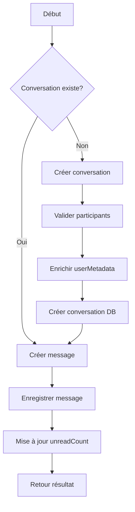
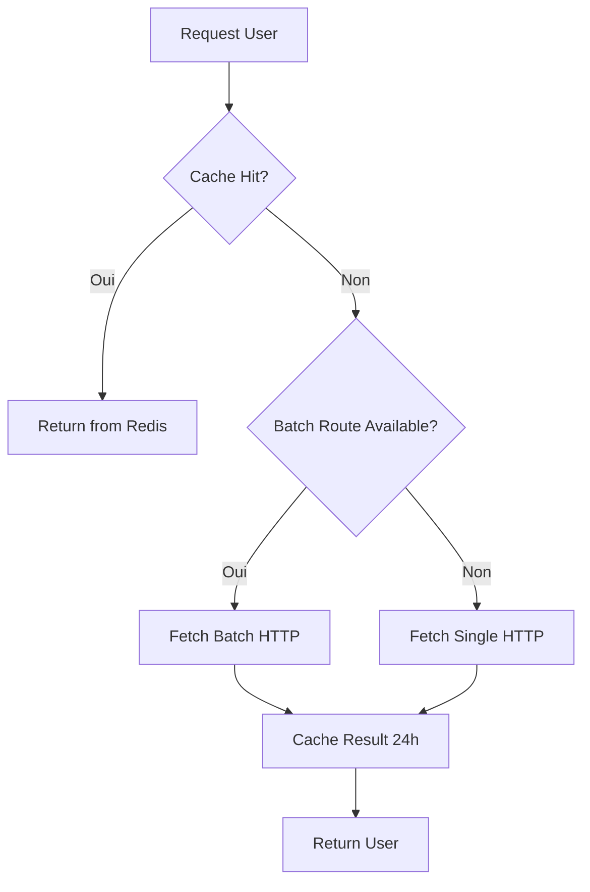

# 📚 Documentation Use Cases - Chat File Service

## 📋 Table des matières

- [Architecture](#architecture)
- [SendMessage](#sendmessage)
- [GetConversations](#getconversations)
- [CreateGroup](#creategroup)
- [CreateBroadcast](#createbroadcast)
- [UserCacheService](#usercacheservice)
- [Exemples d'utilisation](#exemples-dutilisation)

---

## 🏗️ Architecture

Les use cases suivent le **pattern Clean Architecture** avec séparation des responsabilités :

```
Application Layer (Use Cases)
    ↓
Domain Layer (Entities)
    ↓
Infrastructure Layer (Repositories, Services)
```

### Dépendances partagées

Tous les use cases utilisent :

- **UserCacheService** : Enrichissement des profils utilisateurs
- **CachedConversationRepository** : Accès aux conversations avec cache Redis
- **CachedMessageRepository** : Accès aux messages avec cache
- **ResilientMessageService** : Gestion résiliente des messages (Circuit Breaker)

---

## 💬 SendMessage

### Description

Crée et envoie un message dans une conversation. Si la conversation n'existe pas, elle est créée automatiquement avec enrichissement des profils utilisateurs.

### Localisation

`src/application/use-cases/SendMessage.js`

### Constructeur

```javascript
constructor(
  conversationRepository,
  messageRepository,
  userCacheService,
  (resilientMessageService = null)
);
```

### Paramètres d'entrée

```javascript
{
  senderId: String,          // ObjectId MongoDB de l'expéditeur
  conversationId: String,    // ObjectId de la conversation (ou nouveau)
  receiverId: String,        // ObjectId du destinataire (requis si nouvelle conversation)
  content: String,           // Contenu du message
  type: String,              // "TEXT", "IMAGE", "FILE", "AUDIO", "VIDEO"
  metadata: Object           // Métadonnées optionnelles
}
```

### Flux de traitement



### Enrichissement UserMetadata

Chaque participant reçoit des métadonnées enrichies :

```javascript
userMetadata: [
  {
    userId: "507f1f77bcf86cd799439011",
    unreadCount: 0,
    lastReadAt: null,
    isMuted: false,
    isPinned: false,
    customName: null,
    notificationSettings: { enabled: true, sound: true, vibration: true },
    // ✅ Données enrichies depuis UserCacheService
    name: "John Doe",
    avatar: "https://example.com/avatar.jpg",
    departement: "Informatique",
    ministere: "Ministère de l'Intérieur",
  },
];
```

### Validation des utilisateurs

La validation rejette les utilisateurs invalides :

```javascript
if (u.name === "Utilisateur inconnu") {
  throw new Error(`Utilisateurs invalides: ${invalidIds.join(", ")}`);
}
```

### Exemple d'utilisation

```javascript
const sendMessage = new SendMessage(
  conversationRepository,
  messageRepository,
  userCacheService,
  resilientMessageService
);

const result = await sendMessage.execute({
  senderId: "507f1f77bcf86cd799439011",
  conversationId: "507f191e810c19729de860ea", // Ou laisser créer auto
  receiverId: "507f1f77bcf86cd799439012",
  content: "Bonjour! Comment allez-vous?",
  type: "TEXT"
});

// Résultat
{
  success: true,
  message: {
    _id: "...",
    conversationId: "...",
    senderId: "...",
    content: "Bonjour! Comment allez-vous?",
    type: "TEXT",
    createdAt: "2026-01-08T10:30:00.000Z"
  },
  conversation: { ... }
}
```

### Gestion des erreurs

| Erreur                                | Cause                                     | Solution                                 |
| ------------------------------------- | ----------------------------------------- | ---------------------------------------- |
| `Utilisateurs invalides`              | IDs n'existent pas dans auth-user-service | Vérifier les ObjectIds MongoDB           |
| `Impossible de créer la conversation` | Échec enrichissement userMetadata         | Vérifier connectivité auth-user-service  |
| `Contenu requis`                      | Message vide                              | Fournir un contenu                       |
| `Type invalide`                       | Type non supporté                         | Utiliser TEXT, IMAGE, FILE, AUDIO, VIDEO |

---

## 📋 GetConversations

### Description

Récupère les conversations d'un utilisateur avec **catégorisation intelligente**, statistiques et pagination.

### Localisation

`src/application/use-cases/GetConversations.js`

### Constructeur

```javascript
constructor(conversationRepository, messageRepository);
```

### Paramètres d'entrée

```javascript
{
  userId: String,              // ObjectId de l'utilisateur
  page: Number,                // Numéro de page (défaut: 1)
  limit: Number,               // Nombre par page (défaut: 20)
  cursor: String,              // Curseur pour pagination (optionnel)
  direction: String,           // "newer" ou "older"
  includeArchived: Boolean,    // Inclure archivées (défaut: false)
  useCache: Boolean            // Utiliser cache Redis (défaut: true)
}
```

### Catégorisation des conversations

Les conversations sont automatiquement catégorisées en 6 types :

```javascript
categorized: {
  unread: [],       // Conversations avec unreadCount > 0
  groups: [],       // Type === "GROUP"
  broadcasts: [],   // Type === "BROADCAST"
  departement: [],  // PRIVATE avec tous participants du même département
  private: []       // Autres conversations PRIVATE
}
```

### Logique de catégorisation département

```javascript
// Une conversation est "département" si :
// 1. Type PRIVATE
// 2. Tous les participants ont un département
// 3. Tous les participants ont LE MÊME département que l'utilisateur
const isDepartement = conversation.userMetadata.every(
  (meta) => meta.departement && meta.departement === userDepartement
);
```

### Enrichissement senderName

Le nom de l'expéditeur du dernier message est enrichi depuis userMetadata :

```javascript
if (lastMessage && lastMessage.senderId) {
  const senderMeta = conversation.userMetadata?.find(
    (meta) => meta.userId === lastMessage.senderId
  );
  if (senderMeta && senderMeta.name) {
    lastMessage.senderName = senderMeta.name;
  }
}
```

### Statistiques retournées

```javascript
stats: {
  total: 42,                          // Total toutes conversations
  unread: 5,                          // Conversations non lues
  groups: 12,                         // Nombre de groupes
  broadcasts: 3,                      // Nombre de diffusions
  departement: 8,                     // Conversations département
  private: 19,                        // Autres privées
  unreadMessagesInGroups: 23,         // Messages non lus dans groupes
  unreadMessagesInBroadcasts: 7,      // Messages non lus dans diffusions
  unreadMessagesInDepartement: 15,    // Messages non lus département
  unreadMessagesInPrivate: 31         // Messages non lus privées
}
```

### Contexte utilisateur

```javascript
userContext: {
  userId: "507f1f77bcf86cd799439011",
  departement: "Informatique",
  ministere: "Ministère de l'Intérieur"
}
```

### Pagination

```javascript
pagination: {
  currentPage: 1,
  totalPages: 3,
  totalCount: 42,
  hasNext: true,
  hasPrevious: false,
  limit: 20,
  offset: 0,
  nextPage: 2,
  previousPage: null
}
```

### Calcul totalUnreadMessages (IMPORTANT)

Le total est calculé **par utilisateur** depuis userMetadata :

```javascript
totalUnreadMessages: sortedConversations.reduce((sum, c) => {
  if (Array.isArray(c.userMetadata)) {
    // ✅ Chercher l'unreadCount spécifique à l'utilisateur
    const userMeta = c.userMetadata.find((meta) => meta.userId === userId);
    return sum + (userMeta?.unreadCount || 0);
  }
  return sum + (c.unreadCount || 0); // Fallback
}, 0);
```

### Exemple d'utilisation

```javascript
const getConversations = new GetConversations(
  conversationRepository,
  messageRepository
);

const result = await getConversations.execute("507f1f77bcf86cd799439011", {
  page: 1,
  limit: 20,
  useCache: true
});

// Résultat
{
  conversations: [...],          // Toutes les conversations de la page
  categorized: {
    unread: [...],
    groups: [...],
    broadcasts: [...],
    departement: [...],
    private: [...]
  },
  stats: { ... },
  userContext: { ... },
  pagination: { ... },
  totalUnreadMessages: 76,
  processingTime: 145,           // Millisecondes
  fromCache: true
}
```

### Performance

- **Cache Redis** : ~20-50ms
- **MongoDB** : ~100-300ms
- **Enrichissement** : ~50ms par conversation

---

## 👥 CreateGroup

### Description

Crée un groupe de discussion avec enrichissement automatique des profils utilisateurs.

### Localisation

`src/application/use-cases/CreateGroup.js`

### Constructeur

```javascript
constructor(
  conversationRepository,
  userCacheService,
  (resilientMessageService = null)
);
```

### Paramètres d'entrée

```javascript
{
  groupId: String,           // ObjectId du groupe (généré si absent)
  name: String,              // Nom du groupe (requis)
  members: Array<String>,    // ObjectIds des membres
  createdBy: String,         // ObjectId du créateur
  description: String,       // Description (optionnel)
  avatar: String             // URL avatar (optionnel)
}
```

### Validation des membres

```javascript
// Tous les membres doivent être valides
const invalidUsers = usersInfo.filter((u) => u.name === "Utilisateur inconnu");
if (invalidUsers.length > 0) {
  throw new Error("Membres invalides détectés");
}
```

### UserMetadata enrichi

Chaque membre reçoit les mêmes métadonnées qu'une conversation privée :

```javascript
userMetadata: members.map((memberId) => {
  const userInfo = usersInfo.find((u) => u.userId === memberId);
  return {
    userId: memberId,
    unreadCount: 0,
    lastReadAt: null,
    isMuted: false,
    isPinned: false,
    customName: null,
    notificationSettings: { enabled: true, sound: true, vibration: true },
    name: userInfo.name,
    avatar: userInfo.avatar,
    departement: userInfo.departement,
    ministere: userInfo.ministere,
  };
});
```

### Exemple d'utilisation

```javascript
const createGroup = new CreateGroup(
  conversationRepository,
  userCacheService,
  resilientMessageService
);

const result = await createGroup.execute({
  name: "Équipe Dev Backend",
  members: [
    "507f1f77bcf86cd799439011",
    "507f1f77bcf86cd799439012",
    "507f1f77bcf86cd799439013"
  ],
  createdBy: "507f1f77bcf86cd799439011",
  description: "Discussions techniques backend"
});

// Résultat
{
  success: true,
  group: {
    _id: "...",
    type: "GROUP",
    name: "Équipe Dev Backend",
    participants: [...],
    userMetadata: [...],
    createdBy: "507f1f77bcf86cd799439011",
    createdAt: "2026-01-08T10:30:00.000Z"
  }
}
```

---

## 📢 CreateBroadcast

### Description

Crée une liste de diffusion avec distinction admin/destinataires et enrichissement des profils.

### Localisation

`src/application/use-cases/CreateBroadcast.js`

### Constructeur

```javascript
constructor(
  conversationRepository,
  userCacheService,
  (resilientMessageService = null)
);
```

### Paramètres d'entrée

```javascript
{
  broadcastId: String,           // ObjectId de la diffusion (généré si absent)
  name: String,                  // Nom de la diffusion (requis)
  adminIds: Array<String>,       // ObjectIds des admins
  recipientIds: Array<String>,   // ObjectIds des destinataires
  createdBy: String,             // ObjectId du créateur
  description: String,           // Description (optionnel)
  avatar: String                 // URL avatar (optionnel)
}
```

### Distinction Admin/Destinataires

```javascript
// Les admins peuvent écrire, les destinataires reçoivent seulement
participants: [
  ...adminIds,
  ...recipientIds.filter((id) => !adminIds.includes(id)),
];
```

### Validation

```javascript
// Vérifier que tous les utilisateurs existent
const invalidUsers = usersInfo.filter((u) => u.name === "Utilisateur inconnu");
if (invalidUsers.length > 0) {
  const invalidIds = invalidUsers.map((u) => u.userId);
  throw new Error(`Utilisateurs invalides: ${invalidIds.join(", ")}`);
}
```

### Logs détaillés

```javascript
console.log({
  count: usersInfo.length,
  admins: adminIds.length,
  recipients: recipientIds.length,
  users: usersInfo.map((u) => ({ id: u.userId, name: u.name })),
});
```

### Exemple d'utilisation

```javascript
const createBroadcast = new CreateBroadcast(
  conversationRepository,
  userCacheService,
  resilientMessageService
);

const result = await createBroadcast.execute({
  name: "Annonces Équipe",
  adminIds: ["507f1f77bcf86cd799439011"],
  recipientIds: [
    "507f1f77bcf86cd799439012",
    "507f1f77bcf86cd799439013",
    "507f1f77bcf86cd799439014"
  ],
  createdBy: "507f1f77bcf86cd799439011",
  description: "Annonces officielles de l'équipe"
});

// Résultat
{
  success: true,
  broadcast: {
    _id: "...",
    type: "BROADCAST",
    name: "Annonces Équipe",
    participants: [...],
    userMetadata: [...],
    adminIds: ["507f1f77bcf86cd799439011"],
    createdBy: "507f1f77bcf86cd799439011",
    createdAt: "2026-01-08T10:30:00.000Z"
  }
}
```

---

## 🗂️ UserCacheService

### Description

Service de cache Redis pour les profils utilisateurs avec fallback HTTP vers auth-user-service.

### Localisation

`src/infrastructure/services/UserCacheService.js`

### Configuration

```javascript
const CONFIG = {
  CACHE_TTL: 86400, // 24 heures
  AUTH_USER_SERVICE_URL: process.env.AUTH_USER_SERVICE_URL,
  BATCH_ROUTE: "/api/users/batch",
  SINGLE_ROUTE: "/api/users/",
  REQUEST_TIMEOUT: 5000, // 5 secondes
};
```

### Méthodes principales

#### fetchUserInfo(userId)

Récupère un seul utilisateur avec cache.

```javascript
const user = await userCacheService.fetchUserInfo("507f1f77bcf86cd799439011");
// Retour:
{
  userId: "507f1f77bcf86cd799439011",
  name: "John Doe",
  avatar: "https://...",
  matricule: "123456",
  departement: "Informatique",
  ministere: "Ministère de l'Intérieur"
}
```

#### fetchUsersInfo(userIds)

Récupère plusieurs utilisateurs en parallèle.

```javascript
const users = await userCacheService.fetchUsersInfo([
  "507f1f77bcf86cd799439011",
  "507f1f77bcf86cd799439012",
]);
// Retour: Array<User>
```

### Stratégie de cache



### Gestion des utilisateurs invalides

```javascript
// Si utilisateur introuvable:
{
  userId: "507f1f77bcf86cd799439011",
  name: "Utilisateur inconnu",
  avatar: null,
  matricule: null,
  departement: null,
  ministere: null
}
```

### Logs de débogage

```console
📊 [UserCache] Batch: 2 hits, 1 miss
⚠️ [UserCache] Route batch indisponible, fallback requêtes parallèles
⚠️ [UserCache] Utilisateur 507f... introuvable
💾 [UserCache] Cached 507f... (TTL: 86400s)
```

---

## 💡 Exemples d'utilisation

### Scénario 1 : Envoi de message dans nouvelle conversation

```javascript
// Client Socket.IO
socket.emit("sendMessage", {
  conversationId: new ObjectId().toString(), // Nouveau
  receiverId: "507f1f77bcf86cd799439012",
  content: "Salut! Nouveau message",
  type: "TEXT",
});

// Serveur (chatHandler.js)
const result = await sendMessageUseCase.execute({
  senderId: socket.userId,
  conversationId: data.conversationId,
  receiverId: data.receiverId,
  content: data.content,
  type: data.type,
});

// ✅ Conversation créée automatiquement avec userMetadata enrichi
// ✅ Message envoyé
// ✅ UnreadCount mis à jour pour le destinataire
```

### Scénario 2 : Récupération conversations avec filtrage

```javascript
// Client
socket.emit("getConversations", {
  page: 1,
  limit: 20,
});

// Serveur
const result = await getConversationsUseCase.execute(userId, {
  page: 1,
  limit: 20,
  useCache: true,
});

// Affichage frontend par catégorie
result.categorized.unread.forEach((conv) => {
  console.log(`📬 ${conv.name}: ${conv.unreadCount} non lus`);
});

result.categorized.departement.forEach((conv) => {
  console.log(`🏢 ${conv.name}: Département ${userContext.departement}`);
});
```

### Scénario 3 : Création groupe avec validation

```javascript
// Client
socket.emit("createGroup", {
  name: "Dev Team",
  members: [
    "507f1f77bcf86cd799439011",
    "507f1f77bcf86cd799439012",
    "507f1f77bcf86cd799439013",
  ],
});

// Serveur
try {
  const result = await createGroupUseCase.execute({
    name: data.name,
    members: data.members,
    createdBy: socket.userId,
  });

  socket.emit("group:created", result);
} catch (error) {
  // ❌ Si un membre n'existe pas
  socket.emit("group:error", {
    error: error.message, // "Utilisateurs invalides: 507f..."
  });
}
```

---

## 🔧 Configuration environnement

### Variables requises

```bash
# .env
AUTH_USER_SERVICE_URL=http://localhost:3001
REDIS_HOST=localhost
REDIS_PORT=6379
MONGODB_URI=mongodb://localhost:27017/chatapp
```

### Dépendances npm

```json
{
  "dependencies": {
    "@chatapp-ngomna/shared": "^1.0.0",
    "redis": "^4.6.0",
    "mongoose": "^7.0.0",
    "axios": "^1.6.0"
  }
}
```

---

## 📊 Monitoring

### Métriques clés

| Métrique          | Description                    | Seuil   |
| ----------------- | ------------------------------ | ------- |
| Cache Hit Rate    | % requêtes servies par Redis   | > 80%   |
| Processing Time   | Temps exécution use case       | < 200ms |
| UserCache Miss    | Utilisateurs non trouvés       | < 5%    |
| Validation Errors | Utilisateurs invalides rejetés | Monitor |

### Logs à surveiller

```bash
# Succès
✅ Page 1: 20 conversations récupérées (145ms) - CACHE
✅ Message envoyé dans conversation 507f...

# Warnings
⚠️ [UserCache] Utilisateur introuvable
⚠️ Erreur dernier message: Connection timeout

# Erreurs
❌ Erreur récupération infos participants
❌ Utilisateurs invalides: 507f..., 508f...
```

---

## 🐛 Troubleshooting

### "Utilisateurs invalides"

**Cause** : ObjectIds n'existent pas dans auth-user-service

**Solution** :

1. Vérifier que auth-user-service est démarré
2. Tester l'endpoint : `curl http://localhost:3001/api/users/507f...`
3. Utiliser des ObjectIds valides depuis la DB

### "Cache indisponible"

**Cause** : Redis non accessible

**Solution** :

```bash
# Vérifier Redis
redis-cli ping

# Redémarrer si nécessaire
sudo systemctl restart redis
```

### "Processing time > 1000ms"

**Cause** : Trop de conversations ou cache froid

**Solution** :

1. Réduire `limit` dans pagination
2. Activer `useCache: true`
3. Réchauffer le cache au démarrage

---

## 📚 Ressources

- [Architecture Clean](https://blog.cleancoder.com/uncle-bob/2012/08/13/the-clean-architecture.html)
- [Redis Caching Best Practices](https://redis.io/docs/manual/patterns/)
- [MongoDB ObjectId](https://www.mongodb.com/docs/manual/reference/method/ObjectId/)
- [Circuit Breaker Pattern](https://martinfowler.com/bliki/CircuitBreaker.html)

---

**Dernière mise à jour** : 8 janvier 2026
**Version** : 1.0.0
**Auteur** : Équipe ChatApp NGOMNA
